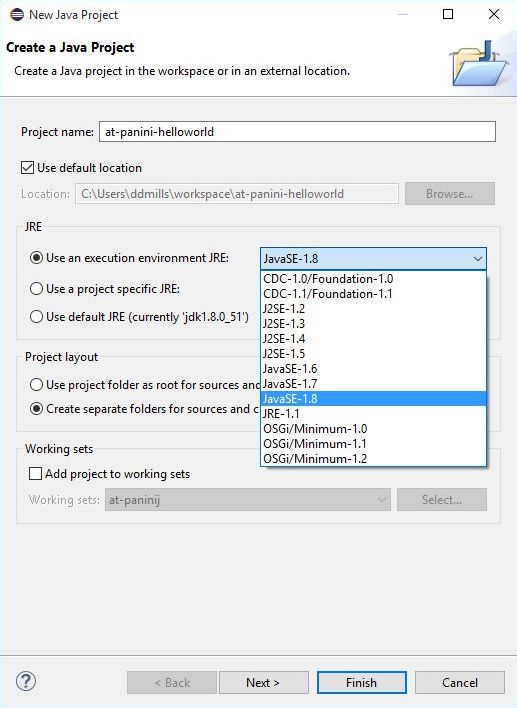
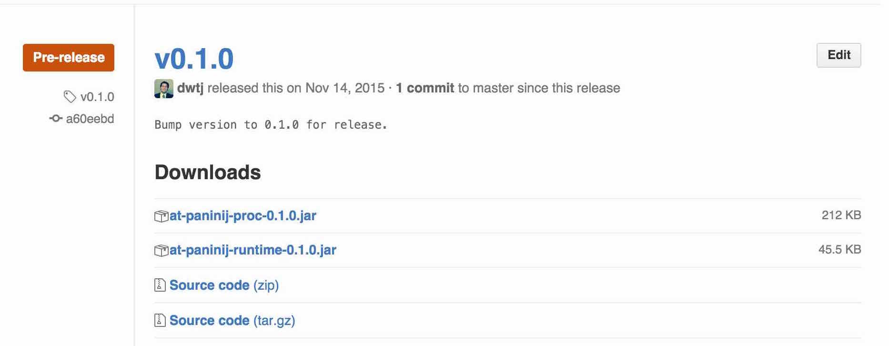
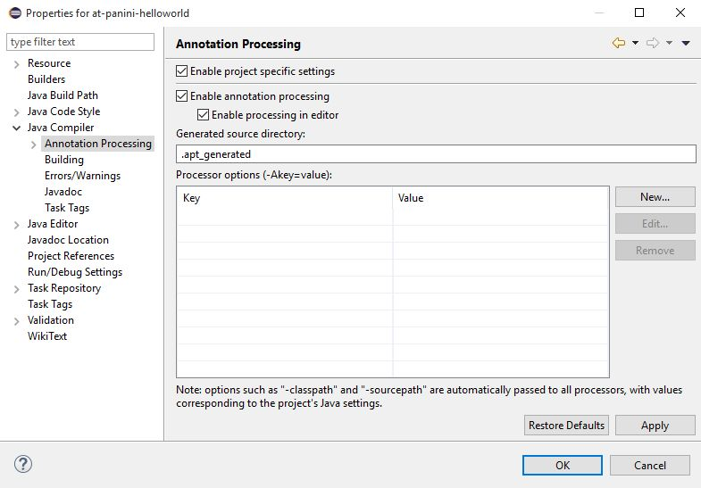
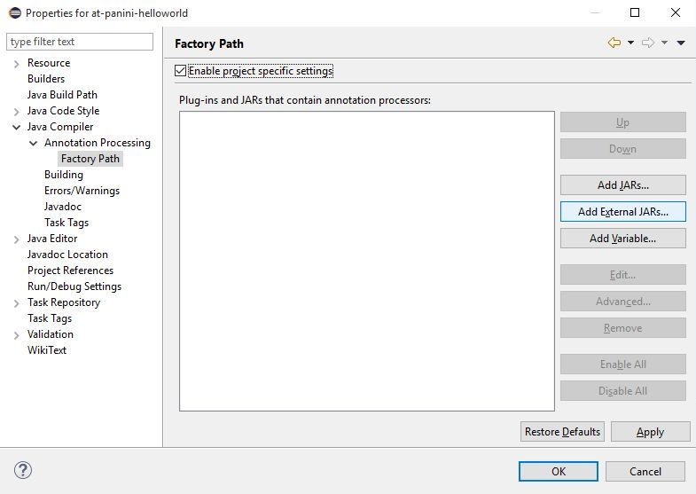
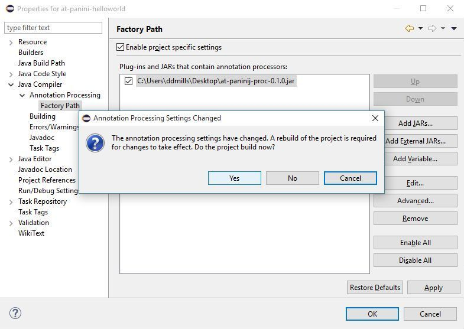
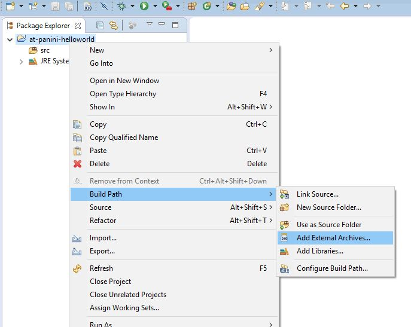
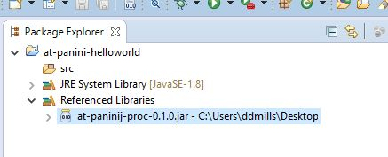

# at-paninij-eclipse-example

This Eclipse project is configured to use the @PaniniJ v0.1.0 annotation
processor. It was created with the Mars release of the "Eclipse IDE for Java
Developers" (v4.5.1).

This project can serve as an example of how Eclipse is configured to begin
`@PaniniJ` development. To clarify how `@PaniniJ` is development is set up
within Eclipse, you may wish to inspect either the configuration files directly
or this project once imported into an Eclipse workspace.

Additionally, the following instructions describe *how to create your own*
`@PaniniJ` Eclipse projects from scratch just like this one.

## Setting up an `@PaniniJ` Project in Eclipse

1. Create a new Eclipse project (JRE 1.7+).
2. Download the `@PaniniJ` processor JAR.
3. Enable annotation processing.
4. Add the `@PaniniJ` annotation processor to the factory path.
5. Add the `@PaniniJ` processor JAR as a referenced library.

### 1. Create a new Eclipse project (JRE 1.7+).

Create a new Java project in Eclipse in the usual way. Be sure to choose JRE 1.7
or greater.

### 2. Download the @PaniniJ processor JAR.

Download the latest version of the annotation processor from the
[GitHub releases page](https://github.com/hridesh/panini/releases),
for example, `at-paninij-proc-0.1.0.jar`.

### 3. Enable annotation processing.

Enable annotation processing by right-clicking on your project in the
project explorer and choosing "Properties". Browse to "Java Compiler >
Annotation Processing" and check the "Enable project specific settings"
and "Enable annotation processing" checkboxes.

Note that the "Generated source directory" is where the sources that the
annotation processor automatically generates will be stored. By removing the "."
from ".apt_generated", this directory and its contents will become visible in
Eclipse.

Once you hit "Apply", Eclipse will inform you that a rebuild of the project is
required. You can click "Yes" to rebuild the project now.

### 4. Add the `@PaniniJ` annotation processor to the factory path.

Navigate to the "Java Compiler > Annotation Processing > Factory Path" section
of the project properties. Check the "Enable project specific settings"
checkbox, and click the "Add External JARs..." button.

Browse to and select the JAR file downloaded in Step 2. Hit "Apply" and confirm
the project rebuild.

### 5. Add the `@PaniniJ` processor JAR as a referenced library.

The @PaniniJ JAR file includes code necessary for both performing code
generation and also running the generated code. For both of these purposes, the
JAR needs to be identified as a "Referenced Library" within your Eclipse. One
way to do this is to right click the project in the project explorer, and choose
"Add External Archives...".

As in Step 4, browse and select the the JAR file downloaded in Step 2. Once this
library is included, the project should look something like this in the Eclipse
Package Explorer:

### Done!

The Eclipse project should now be ready for `@PaniniJ` development. Start
adding code under `src/` just like when developing Java programs.
